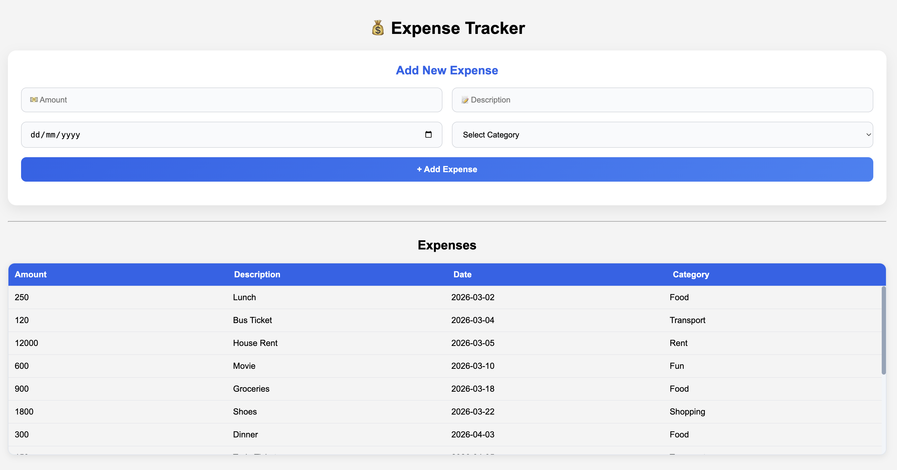
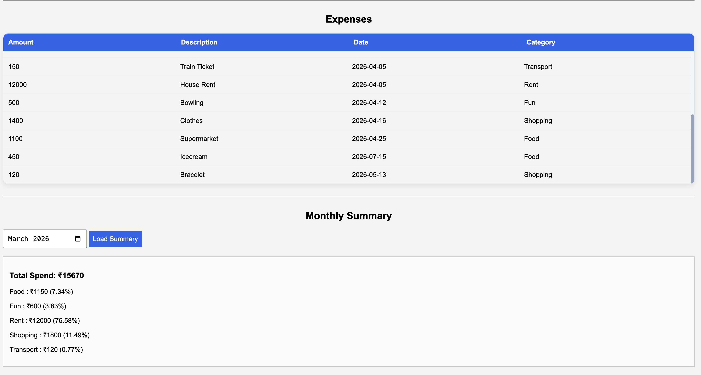

# 💰 TrackMySpend - Expense Tracker 

A full-stack backend project built with **FastAPI**, **SQLAlchemy**, **SQLite**, and **Strawberry GraphQL**. The application exposes both **REST** and **GraphQL** APIs from a single FastAPI application and includes a simple frontend built with **HTML, CSS, and JavaScript**.

This project was developed as a capstone project to demonstrate REST API development, GraphQL integration, database management, testing, and frontend integration.

---

## 🛠️ Tech Stack

- Python 3.11+
- FastAPI
- SQLAlchemy
- Strawberry GraphQL
- SQLite
- Pydantic
- Pytest
- HTML
- CSS
- JavaScript

---

## 📁 Project Structure

```
expense-tracker/
│
├── app/
│   ├── graphql/
│   │   └── schema.py
│   │
│   ├── routes/
│   │   ├── categories.py
│   │   └── expenses.py
│   │
│   ├── static/
│   │   ├── index.html
│   │   ├── style.css
│   │   └── script.js
│   │
│   ├── database.py
│   ├── models.py
│   ├── schemas.py
│   └── main.py
│
├── tests/
│   ├── conftest.py
│   ├── test_categories.py
│   ├── test_expenses.py
│   └── test_graphql.py
│
├── seed.py
├── requirements.txt
├── curl.md
├── postman_collection.json
└── README.md
```

---

## ⚙️ Installation

Clone the repository

```bash
git clone https://github.com/Danushiya/expense_tracker.git
```

Move into the project

```bash
cd expense_tracker
```

Create a virtual environment

### macOS / Linux

```bash
python3 -m venv venv
source venv/bin/activate
```

### Windows

```bash
python -m venv venv
venv\Scripts\activate
```

Install dependencies

```bash
pip install -r requirements.txt
```

---

## 🌱 Seed the Database

Populate the database with sample categories and expenses.

```bash
python seed.py
```

---

## ▶️ Run the Application

```bash
fastapi dev app/main.py
```

Server runs at

```
http://127.0.0.1:8000
```

---

## 📖 API Documentation

Swagger UI

```
http://127.0.0.1:8000/docs
```

ReDoc

```
http://127.0.0.1:8000/redoc
```

---

## 🔗 GraphQL Playground

```
http://127.0.0.1:8000/graphql
```

---

## 🖥️ Frontend

Open in your browser

```
http://127.0.0.1:8000
```

The frontend allows you to:

- View expenses
- Add new expenses
- View monthly summaries
- Load categories using GraphQL

---

## 📬 REST Endpoints

### Categories

| Method | Endpoint |
|---------|----------|
| GET | /categories |
| GET | /categories/{id} |
| POST | /categories |
| PUT | /categories/{id} |
| DELETE | /categories/{id} |

### Expenses

| Method | Endpoint |
|---------|----------|
| GET | /expenses |
| GET | /expenses/{id} |
| POST | /expenses |
| PUT | /expenses/{id} |
| DELETE | /expenses/{id} |
| GET | /expenses/summary?month=YYYY-MM |

---

## 🔷 GraphQL Operations

### Queries

- categories
- expenses

### Mutations

- addExpense
- deleteExpense

---

## ✅ Running Tests

Run all tests

```bash
python -m pytest
```

Example output

```
15 passed
```

---

## 📮 Postman Collection

Import the included Postman collection to test every REST endpoint.

---

## 💻 cURL Examples

The project includes a `curl.md` file containing sample cURL commands for:

- Create Expense
- Get Expense
- Update Expense
- Delete Expense

---

## 📷 Screenshots

<p align="center">
  
</p>

<p align="center">
  
</p>

---

## 📄 License

This project was created for learning purposes.
